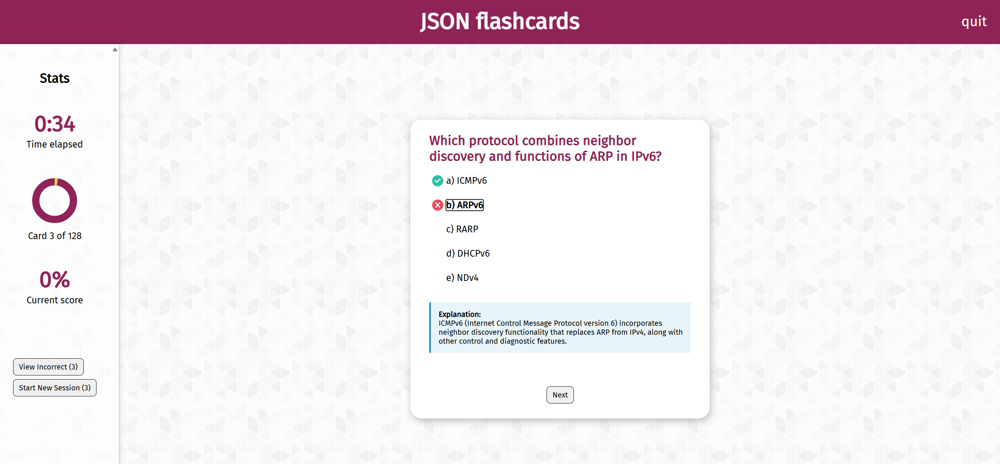

<div style="text-align: center;">
  
</div>

# JSON Flashcards

Just run ```npm install & npm start``` and copy f.e. 1.json. Enjoy.

## **Important!**

### Tell Node to use the legacy OpenSSL provider

- On Unix-like (Linux, macOS, Git bash, etc.):
  ```export NODE_OPTIONS=--openssl-legacy-provider```
- On Windows command prompt:
  ```set NODE_OPTIONS=--openssl-legacy-provider```
- On PowerShell:
  ```$env:NODE_OPTIONS = "--openssl-legacy-provider"```

JSON Flashcards is an app that converts specially formatted .json files into interactive flashcard quizzes with live feedback. Users can easily upload their questions and immediately start using the study tool.

# Features
- Randomization of questions
- Randomization of answers
- Quiz timer
- Immediate feedback
- Progress tracking
- Live score tracking
- Option to repeat quiz
- Option to repeat only incorrectly answered questions

